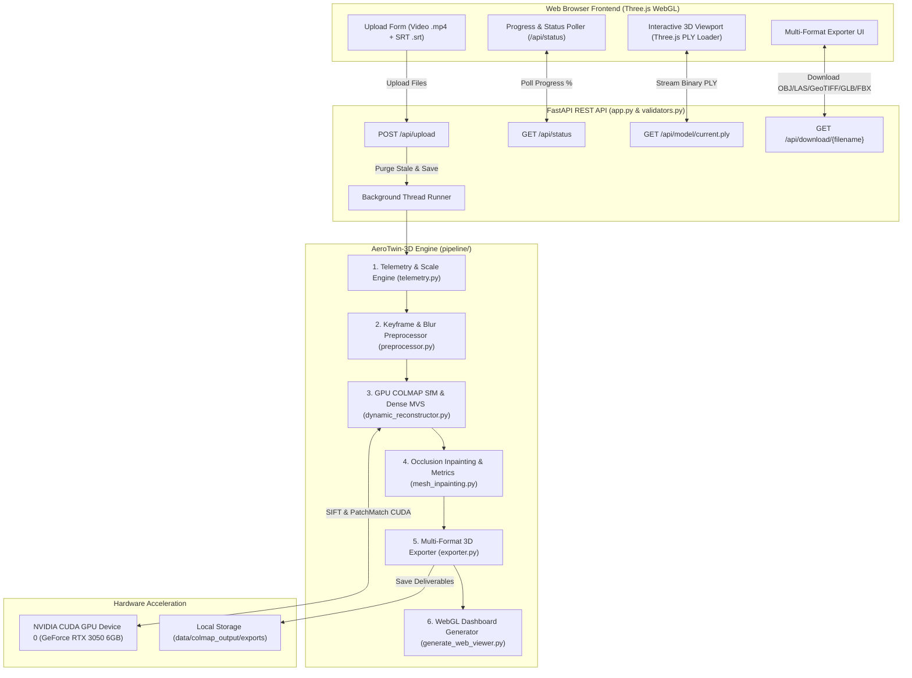

# 🏗️ Architecture & Technical Specification

## System Architecture: AeroTwin-3D Platform

AeroTwin-3D is designed as a decoupled, modular 3D photogrammetry and geospatial engine. It combines a FastAPI REST backend, a GPU-accelerated COLMAP C++ pipeline, and a modern WebGL/Three.js frontend.

---

## 📐 System Data Flow Diagram



---

## 💻 Complete Technology Stack

| Layer | Technology / Library | Purpose / Description |
| :--- | :--- | :--- |
| **Backend Framework** | FastAPI (Python 3.10+) | High-performance asynchronous web API framework |
| **Server Engine** | Uvicorn / Starlette | ASGI web server for file uploads and static file streaming |
| **Photogrammetry Engine** | COLMAP 3.8+ (CUDA C++) | SIFT feature extraction, exhaustive matching, SfM mapper, PatchMatch stereo |
| **GPU Acceleration** | NVIDIA CUDA 12.x | Hardware acceleration for SIFT extraction & dense PatchMatch depth estimation |
| **Computer Vision** | OpenCV (`cv2`) | Video decoding, frame sampling, Laplacian variance blur detection |
| **3D Mesh & Geometry** | Open3D / Trimesh / NumPy | Point cloud cleaning, voxel grid filtering, bounding boxes, OBJ/GLB/FBX export |
| **Geospatial & LiDAR** | `laspy` / `tifffile` | ASPRS LiDAR `.las` generation and GeoTIFF DEM/DSM elevation rasterization |
| **Frontend Renderer** | Three.js (WebGL 2.0) | Real-time 3D point cloud rendering, orbit controls, custom shaders |
| **Frontend Styling** | Tailwind CSS / Custom CSS | Tactical command-center dark mode dashboard UI |

---

## 📁 Repository Directory Structure

```text
sih26158_drone_3d/
├── app.py                      # FastAPI Web Application & Backend REST API
├── config.yaml                 # Master configuration file (single source of truth)
├── validators.py               # Input format & video/SRT timestamp alignment validator
├── requirements.txt            # Python dependencies manifest
├── README.md                   # Project documentation & usage guide
├── PRD.md                      # Product Requirements Document
├── Architecture.md             # System architecture & file layout
├── Rules.md                    # AI development rules & boundaries
├── Phases.md                   # Project execution phases & roadmap
├── Design.md                   # Visual design & UI theme guidelines
├── Memory.md                   # State memory log & progress tracker
│
├── pipeline/                   # Core modular 3D photogrammetry engine
│   ├── __init__.py
│   ├── config.py               # Config loader with deep-merge default fallbacks
│   ├── telemetry.py            # DJI SRT GPS telemetry parser & 1:1 real-world meter scaling
│   ├── preprocessor.py         # Video frame extraction & Laplacian variance blur filtering
│   ├── dynamic_reconstructor.py# COLMAP SfM & GPU PatchMatch MVS reconstruction engine
│   ├── mesh_inpainting.py     # Structural 3D metrics & surface completion engine
│   └── exporter.py             # Multi-format 3D deliverable exporter (OBJ, PLY, LAS, GeoTIFF, GLB, FBX)
│
├── src/                        # Standalone CLI utilities & viewer generators
│   ├── run_pipeline.py         # End-to-end CLI pipeline runner
│   ├── generate_web_viewer.py  # Standalone HTML WebGL dashboard builder
│   ├── view_pointcloud.py      # Interactive Open3D point cloud viewer script
│   └── create_sample_data.py   # Synthetic video and SRT telemetry generator
│
├── static/                     # Web dashboard frontend
│   ├── index.html              # Primary WebGL 3D dashboard & upload interface
│   ├── viewer.js               # Three.js canvas setup, orbit controls, status poller
│   └── style.css               # Tactical command-center dark theme styling
│
└── data/                       # Workspaces and pipeline deliverables
    ├── raw_video/              # Temporary upload location for video (.mp4) & SRT (.srt)
    ├── frames/                 # Extracted sharp keyframes
    └── colmap_output/          # Sparse/dense COLMAP databases, fused PLYs, & export formats
        ├── dense/              # Fused point cloud (fused.ply) & meshed-poisson.ply
        └── exports/            # Deliverable files (aerotwin_model.ply, .obj, .las, .tif, .glb, .fbx)
```

---

## 📡 REST API Specifications

### 1. `POST /api/upload`
* **Description**: Accepts multipart web form upload containing video (`.mp4`) and optional telemetry (`.srt`).
* **Actions**: Purges stale output caches, validates video/SRT alignment, saves files, and triggers background reconstruction worker.
* **Response**: `{"success": true, "message": "Upload successful. Reconstruction triggered."}`

### 2. `GET /api/status`
* **Description**: Returns current pipeline status, execution phase, progress percentage (0–100%), and metric summary.
* **Response**:
  ```json
  {
    "status": "completed",
    "progress": 100,
    "message": "Reconstruction Complete! 485,210 dense 3D points.",
    "metrics": {
      "estimated_building_height": 25.79,
      "spatial_accuracy_m": 0.85
    }
  }
  ```

### 3. `GET /api/model/current.ply`
* **Description**: Streams the latest reconstructed binary PLY 3D point cloud file with strict no-cache headers (`Cache-Control: no-cache, no-store`).

### 4. `GET /api/download/{filename}`
* **Description**: Serves exported deliverable files (`aerotwin_model.obj`, `aerotwin_model.las`, `aerotwin_dem.tif`, `aerotwin_model.glb`, `aerotwin_model.fbx`).
